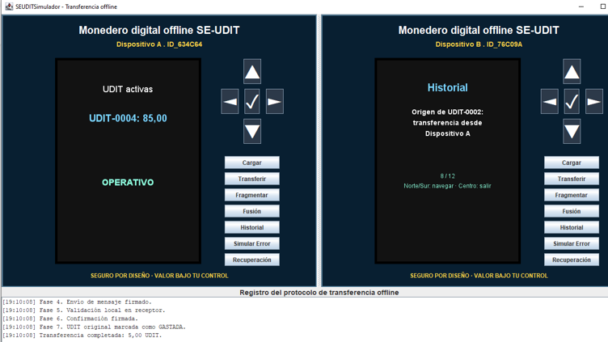
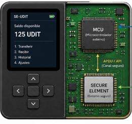

# Universidad Internacional de La Rioja

## Trabajo Fin de Grado

### Grado en Ingeniería Informática

# Arquitectura Segura para la Transferencia Offline de Valor Digital

Repositorio que contiene el código fuente del simulador desarrollado en **Java Swing** mediante **Eclipse** para la validación funcional del Trabajo Fin de Grado.

---

**Figura 1. Simulador SE-UDIT utilizado para la validación funcional del Trabajo Fin de Grado.**



---

## Descripción

Este repositorio contiene el código fuente del simulador desarrollado como apoyo a la validación funcional del Trabajo Fin de Grado **Arquitectura Segura para la Transferencia Offline de Valor Digital**.

El simulador implementa el comportamiento lógico de un sistema de transferencia offline de valor digital basado en las entidades **UDIT** (*Unidad Digital Identitaria y Transferible*) y **SE-UDIT** (*Secure Element para UDIT*), permitiendo validar mediante simulación los protocolos, las máquinas de estados y los mecanismos de seguridad definidos en la propuesta arquitectónica.

La aplicación ha sido desarrollada íntegramente en **Java Swing**, ejecutándose como una aplicación de escritorio y reproduciendo el funcionamiento de dos monederos digitales capaces de intercambiar valor sin necesidad de conectividad con infraestructuras externas.

Los escenarios implementados permiten verificar el correcto funcionamiento de los principales mecanismos definidos en la arquitectura propuesta, proporcionando una evidencia práctica del modelo descrito en la memoria del Trabajo Fin de Grado.

## Funcionalidades implementadas

El simulador reproduce el comportamiento lógico del sistema **SE-UDIT** definido en el Trabajo Fin de Grado, permitiendo representar y validar funcionalmente las principales operaciones asociadas al ciclo de vida de las unidades **UDIT**.

Las funcionalidades implementadas son las siguientes:

* Autenticación mediante PIN de acceso.
* Autenticación mediante PIN de coacción.
* Bloqueo temporal tras intentos fallidos de autenticación.
* Creación inicial de unidades UDIT.
* Transferencia offline entre dos monederos SE-UDIT.
* Fragmentación de unidades UDIT.
* Fusión de unidades UDIT.
* Prevención del doble gasto mediante control del estado.
* Recuperación mediante rollback tras error simulado.
* Historial navegable de operaciones y cambios de estado.

Todas estas funcionalidades han sido desarrolladas con fines de validación funcional de la arquitectura propuesta y reproducen los escenarios descritos en la memoria del Trabajo Fin de Grado.

## Arquitectura del simulador

El simulador ha sido desarrollado como una aplicación de escritorio utilizando **Java Swing** y reproduce el comportamiento funcional de dos monederos digitales **SE-UDIT** que interactúan mediante un protocolo de transferencia offline.

La aplicación representa de forma visual los principales componentes definidos en la arquitectura propuesta para el sistema **UDIT**, permitiendo observar la evolución de las unidades de valor durante las distintas operaciones implementadas.

El diseño se basa en dos monederos virtuales que ejecutan de forma coordinada las operaciones de creación, transferencia, fragmentación, fusión y recuperación, manteniendo en todo momento la conservación del valor y la coherencia del estado de las UDIT.

---

**Figura 2. Representación conceptual del Secure Element utilizado como base del sistema SE-UDIT.**



---

Aunque el simulador reproduce únicamente el comportamiento lógico del sistema, su diseño mantiene una correspondencia directa con la arquitectura descrita en la memoria del Trabajo Fin de Grado, permitiendo visualizar las operaciones críticas, las transiciones de estado y la interacción entre ambos monederos de una forma sencilla e intuitiva.

## Estructura del repositorio

La estructura del repositorio se ha organizado de manera que el código fuente, la documentación y los recursos gráficos queden claramente separados. Esta organización facilita la revisión del proyecto y permite identificar con rapidez los elementos utilizados en la presentación del simulador.

La estructura general del repositorio es la siguiente:

```text
TFG-SE-UDIT-Simulador
│
├── README.md
│
├── LICENSE
│
├── doc
│   └── Memoria_TFG.pdf
│
├── images
│   ├── simulador-se-udit-transferencia-offline.png
│   └── secure-element-se-udit.png
│
└── src
    └── seudit.simulador
        ├── SEUDITSimulador.java
        ├── SimulatorFrame.java
        ├── WalletPanel.java
        ├── WalletModel.java
        ├── Udit.java
        ├── HistoryEntry.java
        ├── DisplayPanel.java
        ├── ChipPanel.java
        ├── Mode.java
        └── AccessState.java
```

El archivo **README.md** constituye la presentación principal del repositorio en GitHub. En él se describe el propósito del simulador, sus funcionalidades implementadas, su relación con la arquitectura propuesta y la forma de ejecutar el proyecto.

La carpeta **doc** se reserva para la documentación complementaria asociada al Trabajo Fin de Grado, como la memoria final en formato PDF u otros documentos relevantes.

La carpeta **images** contiene los recursos gráficos utilizados en el README, incluyendo la captura principal del simulador y la imagen conceptual del Secure Element utilizada para ilustrar la arquitectura del sistema SE-UDIT.

La carpeta **src** contiene el código fuente de la aplicación desarrollada en Java Swing. Dentro del paquete **seudit.simulador** se encuentran la clase principal del simulador y las clases auxiliares que separan la interfaz gráfica, el modelo de datos, las unidades UDIT, el historial y los estados funcionales de la aplicación.

La organización del repositorio permite separar claramente el código fuente, la documentación y las figuras, presentando una estructura fácilmente comprensible para la consulta técnica del proyecto.

## Ejecución del simulador

El simulador ha sido desarrollado en Java Swing utilizando el entorno de desarrollo Eclipse. El proyecto puede ejecutarse como una aplicación de escritorio Java, sin necesidad de instalar servidores, bases de datos ni componentes externos adicionales.

Para ejecutar el simulador, debe abrirse el proyecto en Eclipse y localizar la clase principal **SEUDITSimulador.java**, situada dentro del paquete **seudit.simulador**. Al ejecutar dicha clase como aplicación Java, se muestra la interfaz gráfica del simulador, compuesta por dos monederos digitales SE-UDIT que permiten representar las operaciones principales definidas en la arquitectura propuesta.

La ejecución del simulador permite observar el comportamiento funcional del sistema ante distintos escenarios, como la autenticación mediante PIN, la carga inicial de valor, la transferencia offline entre monederos, la fragmentación, la fusión, el bloqueo por intentos fallidos y la recuperación mediante rollback tras un error simulado.

El funcionamiento de la aplicación se apoya en una interfaz visual sencilla, diseñada para facilitar la comprensión de las transiciones de estado y de las operaciones críticas realizadas sobre las unidades UDIT. De este modo, el simulador actúa como una herramienta de validación funcional y como apoyo gráfico a la explicación desarrollada en la memoria del Trabajo Fin de Grado.

## Escenarios de validación funcional

El simulador permite reproducir distintos escenarios de validación funcional relacionados con los requisitos definidos en la memoria del Trabajo Fin de Grado. Estos escenarios permiten comprobar el comportamiento del sistema ante operaciones normales, situaciones de error y transiciones relevantes del ciclo de vida de las unidades UDIT.

Los principales escenarios representados en el simulador son los siguientes:

* Acceso al sistema mediante PIN correcto.
* Activación del PIN de coacción como mecanismo de seguridad adicional.
* Bloqueo temporal del monedero tras varios intentos fallidos de autenticación.
* Carga inicial de valor y creación de una unidad UDIT activa.
* Transferencia offline de valor entre dos monederos SE-UDIT.
* Destrucción lógica de la UDIT en el monedero de origen y creación de una nueva UDIT en el monedero de destino.
* Fragmentación de una unidad UDIT en dos unidades de menor valor.
* Fusión de varias unidades UDIT en una nueva unidad consolidada.
* Prevención del doble gasto mediante el control del estado de las unidades UDIT.
* Simulación de error durante una operación crítica.
* Recuperación mediante rollback y restauración de un estado coherente.
* Consulta del historial navegable de operaciones y cambios de estado.

Estos escenarios permiten comprobar que el simulador mantiene la conservación del valor, respeta las transiciones de estado previstas y proporciona una representación clara de las operaciones críticas definidas en la arquitectura SE-UDIT.

La validación realizada no pretende sustituir una certificación criptográfica o hardware del sistema, sino demostrar, dentro del alcance funcional del Trabajo Fin de Grado, que los mecanismos principales de la arquitectura propuesta pueden representarse de forma coherente mediante simulación.

## Papel del simulador en la validación del Trabajo Fin de Grado

El simulador incluido en este repositorio forma parte del proceso de validación funcional desarrollado en la memoria del Trabajo Fin de Grado. Su finalidad es proporcionar una representación práctica de los conceptos arquitectónicos definidos para el sistema SE-UDIT y permitir la comprobación de los principales mecanismos propuestos.

La memoria del Trabajo Fin de Grado describe la arquitectura segura para la transferencia offline de valor digital, definiendo las entidades principales del sistema, las máquinas de estados, los protocolos de operación y los mecanismos de seguridad asociados. El simulador permite trasladar estos elementos a un entorno visual de prueba, facilitando la observación del comportamiento del sistema ante distintos escenarios funcionales.

En particular, el simulador permite comprobar la correspondencia entre los requisitos funcionales definidos en la memoria y su representación práctica mediante operaciones ejecutables. Entre estos aspectos se incluyen la autenticación, la creación de unidades UDIT, la transferencia offline, la fragmentación, la fusión, la prevención del doble gasto, la gestión de errores y la recuperación mediante rollback.

De este modo, el repositorio complementa la memoria académica del Trabajo Fin de Grado, aportando una evidencia práctica del modelo propuesto y reforzando la trazabilidad entre la arquitectura diseñada, los escenarios de validación y el comportamiento observado durante la simulación.

## Alcance de la simulación

El alcance del simulador se centra en la validación funcional de los mecanismos principales definidos en la arquitectura SE-UDIT. Para ello, la aplicación reproduce el comportamiento lógico de las unidades UDIT y de los monederos digitales que intervienen en las operaciones de carga, transferencia, fragmentación, fusión y recuperación.

La simulación permite comprobar que las operaciones implementadas mantienen la conservación del valor, respetan el estado de las unidades UDIT y evitan que una misma unidad pueda ser utilizada de forma incoherente dentro del flujo funcional representado. Asimismo, permite observar la evolución de las operaciones críticas mediante una interfaz gráfica que facilita la comprensión de los estados alcanzados por el sistema.

El desarrollo se orienta a representar los aspectos funcionales de la arquitectura propuesta. Por este motivo, los elementos criptográficos, la implementación física del Secure Element, la certificación hardware y los mecanismos de protección física se consideran parte del diseño conceptual descrito en la memoria del Trabajo Fin de Grado, pero no se implementan a nivel físico en el simulador.

De este modo, el simulador permite validar la coherencia funcional del modelo propuesto dentro del alcance establecido para el Trabajo Fin de Grado, aportando una base práctica para analizar el comportamiento del sistema ante los escenarios definidos.

## Tecnologías y entorno de desarrollo

El simulador SE-UDIT ha sido desarrollado utilizando el lenguaje de programación **Java** y la biblioteca gráfica **Java Swing**, lo que permite construir una aplicación de escritorio independiente, ejecutable en un entorno local y sin dependencia de servicios externos.

El desarrollo se ha realizado mediante el entorno **Eclipse**, empleado para la edición, compilación y ejecución del proyecto. Esta elección facilita la organización del código fuente y permite reproducir el funcionamiento del simulador de forma sencilla durante la revisión académica del Trabajo Fin de Grado.

Las tecnologías principales utilizadas en el proyecto son las siguientes:

* **Java**, como lenguaje principal de programación.
* **Java Swing**, para la construcción de la interfaz gráfica de usuario.
* **Eclipse IDE**, como entorno de desarrollo utilizado para implementar y ejecutar el simulador.
* **GitHub**, como plataforma de publicación del repositorio y presentación del código fuente asociado al Trabajo Fin de Grado.

La elección de Java Swing responde a la necesidad de disponer de una herramienta visual, local y fácilmente ejecutable, adecuada para representar el comportamiento funcional de dos monederos digitales SE-UDIT y observar las operaciones críticas realizadas sobre las unidades UDIT.

El uso de una aplicación de escritorio permite centrar la validación en la lógica del sistema, en las transiciones de estado y en la conservación del valor, sin introducir dependencias adicionales relacionadas con servidores, bases de datos, redes de comunicación o infraestructuras externas.

## Organización interna del código fuente

El código fuente del simulador se organiza en clases independientes dentro del paquete **seudit.simulador**, separando las principales responsabilidades de la aplicación. Esta estructura favorece la legibilidad, la mantenibilidad y la presentación técnica del proyecto.

La clase **SEUDITSimulador.java** actúa como punto de entrada de la aplicación. Desde ella se inicia la interfaz gráfica principal del simulador, delegando la construcción de la ventana y la lógica funcional en el resto de clases del proyecto.

La estructura interna del código fuente se organiza de la siguiente forma:

```text
seudit.simulador
│
├── SEUDITSimulador.java
├── SimulatorFrame.java
├── WalletPanel.java
├── WalletModel.java
├── Udit.java
├── HistoryEntry.java
├── DisplayPanel.java
├── ChipPanel.java
├── Mode.java
└── AccessState.java
```

La clase **SimulatorFrame.java** representa la ventana principal de la aplicación y coordina la creación de los dos monederos digitales simulados, así como el registro inferior donde se muestran las fases del protocolo de transferencia offline.

La clase **WalletPanel.java** contiene la lógica principal de interacción de cada monedero, incluyendo los botones de operación, la autenticación mediante PIN, la carga inicial, la transferencia, la fragmentación, la fusión, el historial y la recuperación mediante rollback.

La clase **WalletModel.java** almacena el estado interno de cada monedero, incluyendo el saldo, las unidades UDIT activas, el historial de operaciones, los estados de acceso, los intentos fallidos de autenticación y las operaciones pendientes.

La clase **Udit.java** representa cada unidad digital identitaria y transferible dentro de la simulación, incluyendo su identificador, valor, estado funcional, origen y monedero asociado.

La clase **HistoryEntry.java** representa cada entrada del historial de operaciones, permitiendo registrar de forma ordenada los cambios relevantes producidos durante la ejecución del simulador.

Las clases **DisplayPanel.java** y **ChipPanel.java** se encargan de la representación visual del monedero. La primera dibuja la pantalla principal del dispositivo simulado, mientras que la segunda aporta un componente visual auxiliar asociado a la representación del monedero SE-UDIT.

Finalmente, los enumerados **Mode.java** y **AccessState.java** recogen los estados de interacción y acceso utilizados por el simulador, facilitando una representación más clara de los modos de operación y de autenticación del sistema.

Esta organización separa la lógica funcional, el modelo de datos, la interfaz gráfica y los estados del simulador, ofreciendo una estructura coherente con un proyecto Java organizado de forma profesional.

**Figura 3. Esquema lógico de organización interna del simulador SE-UDIT.**

```text
SEUDITSimulador
│
└── SimulatorFrame
    │
    ├── WalletPanel
    │   │
    │   ├── WalletModel
    │   │   ├── Udit
    │   │   └── HistoryEntry
    │   │
    │   ├── DisplayPanel
    │   └── ChipPanel
    │
    ├── Mode
    └── AccessState
    
   
```
    Este esquema no pretende ser un diagrama UML formal, sino una representación clara de cómo se organiza internamente el simulador: clase de arranque, ventana principal, paneles de monedero, modelo de datos, unidades UDIT, historial, pantalla visual y estados funcionales.


## Autoría y uso académico

Este repositorio forma parte del Trabajo Fin de Grado **Arquitectura Segura para la Transferencia Offline de Valor Digital**, desarrollado por **Emiliano González Martín** en el marco del Grado en Ingeniería Informática de la Universidad Internacional de La Rioja (UNIR).

El contenido del repositorio tiene una finalidad académica y se presenta como complemento práctico a la memoria del Trabajo Fin de Grado. Su objetivo es mostrar el simulador desarrollado para validar funcionalmente los principales mecanismos definidos en la arquitectura SE-UDIT.

El código fuente, las imágenes y la documentación incluida en este repositorio deben entenderse dentro del contexto del proyecto académico al que pertenecen. El simulador no se presenta como una solución comercial, sino como una herramienta de apoyo para la explicación, demostración y validación funcional del modelo propuesto.

La publicación del repositorio facilita la revisión del trabajo realizado, muestra la trazabilidad entre la propuesta teórica y la implementación funcional, y conserva una evidencia técnica del desarrollo llevado a cabo durante el Trabajo Fin de Grado.

## Licencia

Este repositorio se publica con finalidad académica como parte del Trabajo Fin de Grado **Arquitectura Segura para la Transferencia Offline de Valor Digital**.

El código fuente del simulador puede consultarse con fines de revisión, estudio y evaluación del proyecto. Cualquier reutilización, modificación o distribución deberá respetar la autoría original y el contexto académico en el que ha sido desarrollado.

La licencia concreta del repositorio se indicará mediante el archivo **LICENSE**, incluido en la raíz del proyecto.

## Conclusión

El repositorio **TFG-SE-UDIT-Simulador** recoge el resultado práctico del trabajo de validación funcional desarrollado en el marco del Trabajo Fin de Grado **Arquitectura Segura para la Transferencia Offline de Valor Digital**.

El simulador permite representar de forma ejecutable los principales mecanismos definidos en la propuesta arquitectónica SE-UDIT, mostrando el comportamiento de dos monederos digitales offline durante operaciones como la carga inicial, la transferencia de valor, la fragmentación, la fusión, la prevención del doble gasto y la recuperación ante errores.

La combinación de la memoria académica y del simulador implementado permite reforzar la trazabilidad entre el diseño conceptual, los requisitos funcionales, las máquinas de estados, los protocolos definidos y los escenarios de validación observados.

De este modo, el repositorio actúa como complemento técnico de la memoria del Trabajo Fin de Grado y proporciona una evidencia práctica del modelo propuesto, facilitando su revisión, comprensión y evaluación.

